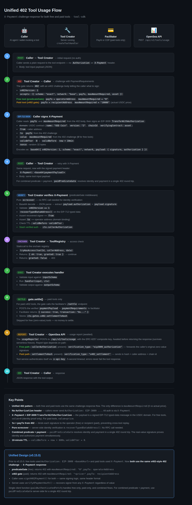

# Tool Invocation Flow

Unified 402 challenge-response for both free and paid tools.



## Sequence Diagram

```
Caller                    Tool Server                 ToolRegistry (onchain)     Facilitator        OpenSea API
  │                            │                            │                       │                   │
  │  1. POST /tool (no auth)   │                            │                       │                   │
  │ ────────────────────────> │                            │                       │                   │
  │                            │                            │                       │                   │
  │  2. 402 PaymentRequirements│                            │                       │                   │
  │    maxAmountRequired: "0"  │  (free)                    │                       │                   │
  │    maxAmountRequired: amt  │  (paid)                    │                       │                   │
  │ <──────────────────────── │                            │                       │                   │
  │                            │                            │                       │                   │
  │  3. Sign X-Payment         │                            │                       │                   │
  │  (EIP-3009                 │                            │                       │                   │
  │   TransferWithAuthorization│                            │                       │                   │
  │   from: caller             │                            │                       │                   │
  │   to: payTo from 402       │                            │                       │                   │
  │   value: 0 or amount       │                            │                       │                   │
  │   nonce: random 32 bytes)  │                            │                       │                   │
  │                            │                            │                       │                   │
  │  4. POST /tool             │                            │                       │                   │
  │  X-Payment: base64(...)    │                            │                       │                   │
  │ ────────────────────────> │                            │                       │                   │
  │                            │                            │                       │                   │
  │                            │  5. ecrecover X-Payment    │                       │                   │
  │                            │     recover caller address │                       │                   │
  │                            │     verify to == operator  │                       │                   │
  │                            │     check TTL              │                       │                   │
  │                            │                            │                       │                   │
  │                            │  6. tryHasAccess(toolId,   │                       │                   │
  │                            │     callerAddr, data)      │                       │                   │
  │                            │ ────────────────────────> │                       │                   │
  │                            │   granted: true/false      │                       │                   │
  │                            │ <──────────────────────── │                       │                   │
  │                            │     false → 403            │                       │                   │
  │                            │                            │                       │                   │
  │                            │  7. handler(input, ctx)    │                       │                   │
  │                            │     validate input/output  │                       │                   │
  │                            │                            │                       │                   │
  │                            │  8. gate.settle() ─────────────────────────────> │                   │
  │                            │     (paid only: POST       │                       │                   │
  │                            │      /settle with payload) │  { tx: "0x..." }      │                   │
  │                            │ <───────────────────────────────────────────────── │                   │
  │                            │                            │                       │                   │
  │                            │  9. POST /api/v2/tools/usage ──────────────────────────────────────> │
  │                            │     (awaited before response)                      │                   │
  │                            │     free: eip3009_authorization (forward signature)│                   │
  │                            │     paid: x402_settlement (forward tx hash)        │                   │
  │                            │ <────────────────────────────────────────────────────────────────── │
  │                            │                            │                       │                   │
  │  10. 200 OK (tool output)  │                            │                       │                   │
  │ <──────────────────────── │                            │                       │                   │
```

### Key details

- **Unified 402 pattern** — free and paid tools use the same challenge-response. The only difference is `maxAmountRequired` (`"0"` vs actual USDC price).
- **X-Payment = EIP-3009 `TransferWithAuthorization`** — signed EIP-712 typed data in the USDC domain. `value=0` for identity proof only; `value=price` for paid tools.
- **Pure ecrecover** — server-side identity verification is `recoverTypedDataAddress()`, no RPC needed.
- **Combined predicate + payment** — `paidPredicateGate` resolves identity and payment in a single 402 round trip. The real-value signature proves identity (`from`) and authorizes payment simultaneously. Predicate is checked before settlement — if access denied, 403 and no funds move.
- **Usage reporting is awaited** — the report completes before the 200 is returned (survives serverless freeze). 5-second timeout; errors never fail the tool response.
- **10-minute TTL** — `validBefore = now + 600s`, `validAfter = 0`.
- **Single signature** — the caller's original EIP-3009 auth is forwarded to the usage API as-is; the tool server never re-signs.
